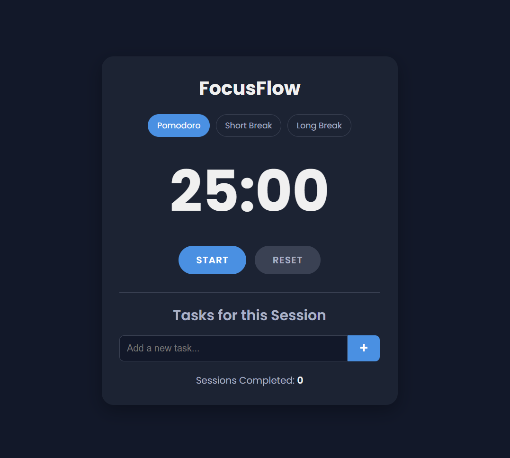

# FocusFlow

FocusFlow is a minimalist yet powerful Pomodoro-based planner designed to help you stay focused and manage your tasks effectively. By combining the Pomodoro Technique with a simple task list, FocusFlow provides a seamless workflow to boost your productivity.

 <!-- TODO: Replace with an actual screenshot -->

## ✨ Features

- **Pomodoro Timer:** A classic 25-minute timer to help you focus intensely.
- **Break Timers:** Includes 5-minute short breaks and 15-minute long breaks.
- **Automatic Cycle:** The timer automatically cycles through Pomodoro sessions and breaks. A long break is suggested after four Pomodoro sessions.
- **Task Management:**
  - Add tasks to your session list.
  - Mark tasks as completed.
  - Delete tasks you no longer need.
- **Session Counter:** Keeps track of the number of Pomodoro sessions you've completed.
- **Persistent Data:** Your tasks and completed session count are automatically saved in your browser's local storage, so you can pick up where you left off.
- **Audio Notifications:** A subtle sound alerts you when a timer session is complete.
- **Clean & Modern UI:** A beautiful, dark-themed, and responsive design that's easy on the eyes.

## 🚀 How to Use

1.  **Open the Application:** Simply open the `index.html` file in your web browser.
2.  **Set Your Mode:**
    - Choose between "Pomodoro," "Short Break," or "Long Break."
    - The timer is set to a 25-minute Pomodoro session by default.
3.  **Manage Your Tasks:**
    - Add your tasks for the session using the input field.
    - Click on a task to mark it as complete.
    - Click the '×' button to delete a task.
4.  **Start the Timer:**
    - Press the **START** button to begin the timer.
    - You can **PAUSE** the timer at any time or **RESET** it to the beginning of the current mode's time.
5.  **Follow the Flow:**
    - Once a session ends, an alarm will sound, and the timer will automatically switch to the next appropriate mode (a short break or a long break).
    - Your completed Pomodoro session count will be updated.

## 🛠️ Technologies Used

- **HTML5:** For the structure of the application.
- **CSS3:** For styling and creating the modern look and feel.
- **JavaScript (ES6+):** For all the application logic, including the timer, task management, and local storage.

---

Made with ❤️ for enhanced productivity.
 